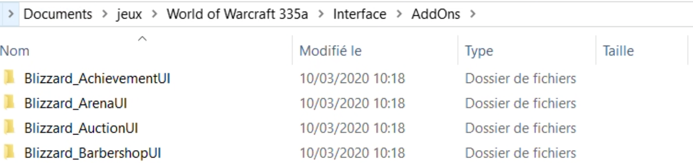
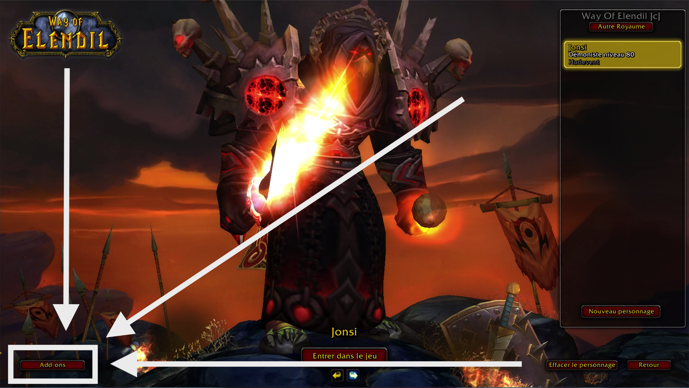
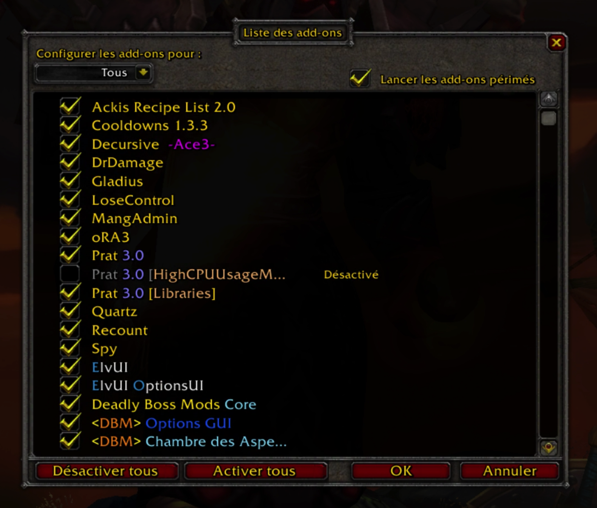

# Les Addons compatibles 3.3.5


Way of Elendil propose cette liste d'addons mais n'est en aucun cas responsable de ces addons. Nous ne pouvons pas vous assister pas dans le paramétrage, et en cas de dysfonctionnement nous n'engageons aucune responsabilité.


## Installer un AddOn sur World of Warcraft 

Téléchargez l'addon de votre choix au format ZIP, puis dezippez le.

Rendez vous dans votre dossier World of Warcraft et plus précisément le dossier **Interfaces &gt; Addons**

```bash
C:\World of Warcraft 335a\Interface\AddOns
```



Collez votre Addon dézippé directement dans ce dossier AddOns, et c'est tout, votre AddOn est installé !


Faites attention à toujour avoir une arborescence comme suit : _**Dossier &gt; Fichiers**_ ****  
Et surtout pas _**Dossier &gt; Dossier &gt; Fichiers**_**,** dans ce cas, le jeu ne détectera pas votre AddOn  
[Exemple d'un AddOn bien installé](https://screens.way-of-elendil.fr/mFZao3fS.png) _\(voir l'arborescence: AddOns **&gt;** DBM-Icecrown **&gt; Fichiers**\)_


##  Activer un AddOn sur Worlf of Warcraft

Lancer World of Warcraft et arrêtez vous sur la page qui affiche vos personnages. Cliquez sur le bouton Add-ons en bas à gauche de votre personnage : 



Cochez simplement votre AddOn pour l'activer au sein du jeu.


Si vous ne voyez pas votre AddOn dans la liste, cochez "**Lancer les add-ons périmés**" visible en haut à droite de cette fenêtre. 




Si votre AddOn n'apparait toujours pas dans la liste, il n'est peut être pas compatible avec l'extension Wrath of The Lich King. Il vous faudra trouver une version compatible ou une alternative.

Normalement tous les AddOns proposés par Elendil sont compatibles avec Wrath of The Lich King, si vous constatez une anomalie [merci de venir nous la signaler sur Discord.](https://discord.gg/bK8rRN3) 

## Ajouter un AddOn dans la liste proposée par Way of Elendil

Si vous avez un AddOn que vous ne trouvez pas dans la liste et que vous estimez pertinent, [contactez l'équipe de Way of Elendil sur Discord](https://discord.gg/bK8rRN3) pour leur proposer votre AddOn afin qu'il soit rajouté à la liste des AddOns disponibles au téléchargement.

