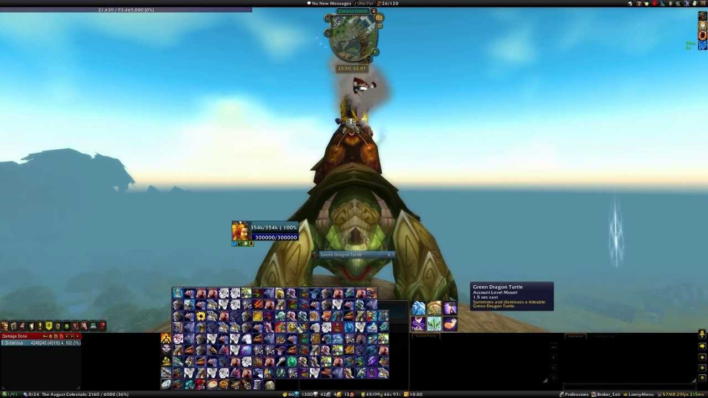
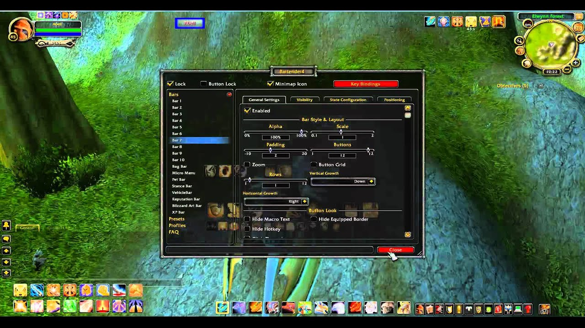
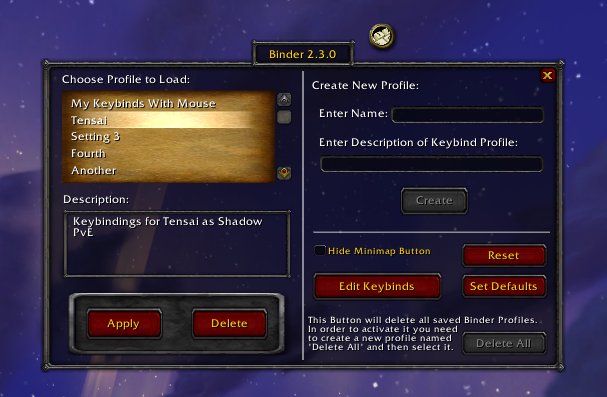
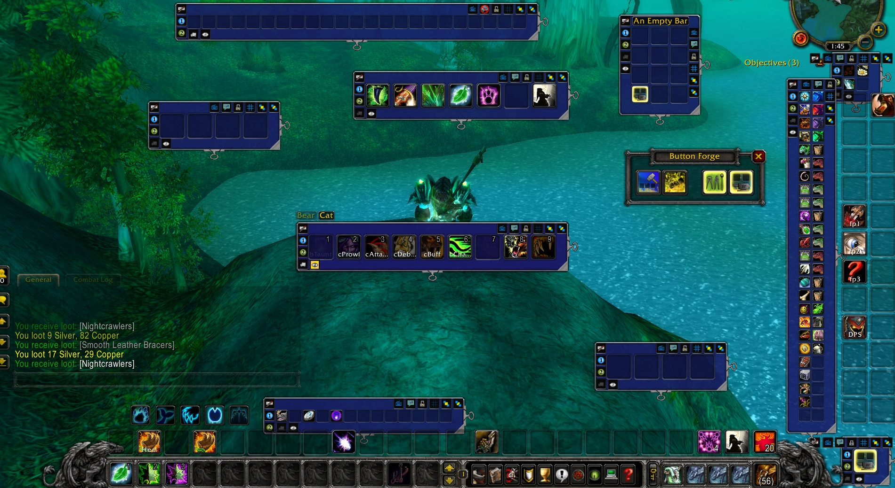
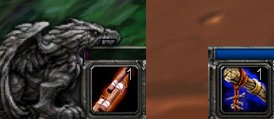
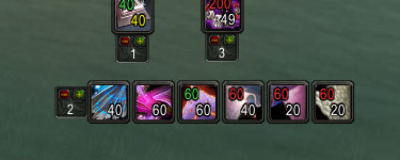
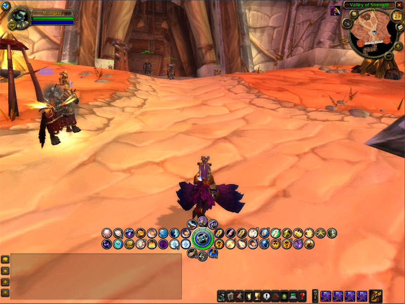
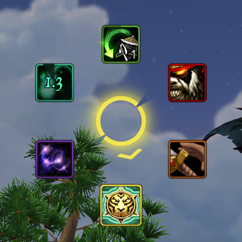
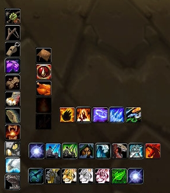

# Barres d'action

## ActionBarSaver

Petit mod rapide, vous permet de configurer différents profils pour vos barres d'action. Il s'adresse principalement aux classes hybrides qui veulent pouvoir se respe sans passer 10 à 20 minutes à configurer leurs barres d'action. Il suffit de taper /abs save  et cela enregistrera l'emplacement de tous vos sorts, macros et éléments.

Par exemple, si vous êtes actuellement un druide sauvage, vous pouvez taper /abs save feral puis respec to Resto et configurer vos barres d'action, puis taper /abs save resto une fois que vous revenez respec to Feral, vous pouvez alors réentraîner tous vos sorts et taper /abs restore feral et vous obtiendrez votre configuration de sauvage sans avoir à trouver où vous avez placé les choses.

Fonctionne avec n'importe quelle interface personnalisée comme les bongos, à condition de ne pas utiliser plus que les 120 boutons d'action standard. Ceux qui offrent des fonctionnalités permettant de dépasser 120 ne feront que les 120 standards pour être sauvegardés/restaurés.&#x20;


ActionBarSaver


## autobar

AutoBar est un mod multi-barres qui ajoute automatiquement des potions, de l'eau, de la nourriture, des quêtes et d'autres éléments que vous spécifiez dans les boutons pour une utilisation facile.

* N'épuise pas les slots d'action.&#x20;
* Vous pouvez créer vos propres catégories d'objets, en y faisant glisser des objets provenant de sacs ou des sorts provenant de livres de sorts.&#x20;
* Vous pouvez créer des boutons personnalisés qui contiennent une ou plusieurs catégories personnalisées ou intégrées.&#x20;
* Vous pouvez créer des barres personnalisées pour organiser vos boutons en fonction de vos besoins d'interface.

WoW propose des milliers d'articles que vous pouvez obtenir. AutoBar organise automatiquement les articles fréquemment utilisés pour vous, ce qui vous évite de glisser des objets de vos sacs vers une barre d'action. Comme AutoBar n'utilise pas les emplacements d'action limités disponibles, vous pouvez les sauvegarder pour vos sorts et vos capacités.



## bartender


Conseillé et validé par l'équipe !


Bartender v4 est un modificateur de barre d'action, celui replace toute vos barres au centre, ainsi vous ne perdrez plus de temps à trop déplacer votre souris pour effectuer vos sorts, cependant l'addon est un peu déroutant au début, néanmoins avec un peu d'entrainement vous trouverez vite vos marques et gagnerez un temps précieux si vous ne jouez pas au clavier.



## binder

Cet addon vous permettra de sauvegarder vos raccourcis clavier actuels sous forme de profil, que vous nommerez et pour lequel vous pourrez créer une description (aucune description n'est requise). Ces profils sont basés sur des comptes, ce qui signifie que vous pouvez accéder aux mêmes profils sur n'importe lequel de vos personnages sur le même compte.



## buttonfacade

Masque est un add-on pour World of Warcraft qui fournit un moteur de skinning pour les add-ons basés sur des boutons.&#x20;



## Button Forge

Button Forge est un addon de barre d'action qui vous permet de créer des barres d'action complètement nouvelles (autant que vous le souhaitez). Chaque barre peut comporter jusqu'à 1500 boutons organisés en lignes et en colonnes (jusqu'à 5000 boutons au total).



## CooldownCount

Cet addon affiche un grand nombre jaune (et du texte pour les nombres > 60 secondes) sur les icônes de sorts pour les barres d'action, les sacs, la feuille de personnage et les icônes de quêtes dans le traqueur. La police de caractères peut être modifiée, et la durée de refroidissement nécessaire à l'affichage sur le bouton peut également être modifiée. Le chiffre commence à clignoter lorsque le temps restant est inférieur à 10 secondes.



## chocolatebar

ChocolateBar créera une barre en haut ou en bas de votre écran où d'autres addons appelés plugins de courtage peuvent afficher des choses comme vos fps par exemple.



## cooldowns


Conseillé et validé par l'équipe !


Add-on permettant de voir le cooldown de vos attaque (c'est à dire le temps restant avant de pouvoir la réutiliser). Il affiche sur l'icône de l'attaque lancé un compte à rebours. Une petite lumière sur l'icône de l'attaque indique la fin du compte à rebours, donc vous pouvez relancer l'attaque.



## dominos

Dominos est un addon permettant de mettre les barres de sort, d'XP, d'actions, etc... où vous le voulez sur votre écran.



## DragonHider

Cache le vilain dragon à gauche et à droite de votre barre d'action



## DrDamage


Conseillé et validé par l'équipe !


Un addon de calcul des sorts qui fournit à toutes les classes magiques d'indispensables infos sur les dégâts de ses sorts, et affiches par dessus l'icône du sort en question son DPS moyen. Appelé docteur damage ou drdamage.



## FarmIt2

Surveillez activement la quantité de devises ou d'articles (y compris ce qui se trouve dans votre banque) que vous avez en votre possession et qui ont des objectifs d'agriculture personnalisée. Recevez des notifications au fur et à mesure de votre progression, et entendez le son familier "quête terminée" lorsque vous atteignez le montant visé. FarmIt est un outil d'agriculture "à fixer et à oublier".



## LunarSphere

LunarSphere est une version toutes classes des populaires addons "sphère" qui existent pour différentes classes dans World of Warcraft.



## OmniCC

L'add-on omni CC permettant de voir le cooldown de vos attaque (c'est à dire le temps restant avant de pouvoir la réutiliser). Il affiche sur l'icône de l'attaque lancé un compte à rebours. Une petite lumière sur l'icône de l'attaque indique la fin du compte à rebours, donc vous pouvez relancer l'attaque.



## OPie

OPie est un module complémentaire de liaison d'action radiale : il vous permet de regrouper des actions en anneaux qui apparaissent lorsque vous maintenez la liaison clavier ou souris enfoncée. Lorsque vous relâchez le lien, OPie effectue une action en fonction de l'endroit où se trouve le curseur de la souris.



## Speedy Actions

Simple addon, tout ce qu'il fait, c'est accélérer le déclenchement des actions en les faisant se produire lorsque vous appuyez sur une touche ou que vous appuyez sur votre souris plutôt que de les relâcher. Il est configuré pour fonctionner avec toutes les barres d'action par défaut de Blizzard ainsi qu'avec l'invocation et le rappel de totems. Il fonctionnera automatiquement avec tout addon qui utilise le système Blizzard par défaut pour les raccourcis clavier (Menu Jeu -> Raccourcis clavier).



## XBar

Un cadre d'interface personnalisable pour supporter des barres de boutons mobiles et personnalisées.


