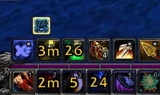
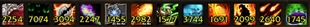
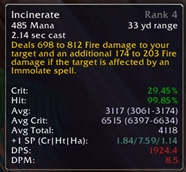
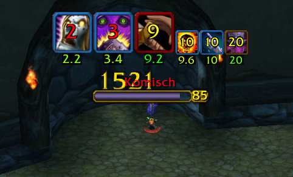

# Barres d'action

## actionbarsaver



## autobar



## bartender

Bartender v4 est un modificateur de barre d'action, celui replace toute vos barres au centre, ainsi vous ne perdrez plus de temps à trop déplacer votre souris pour effectuer vos sorts, cependant l'addon est un peu déroutant au début, néanmoins avec un peu d'entrainement vous trouverez vite vos marques et gagnerez un temps précieux si vous ne jouez pas au clavier.



## binder



## buttonfacade



## buttonforge



## cooldowncount



## chocolatebar



## cooldowns


Conseillé et validé par l'équipe !


Add-on permettant de voir le cooldown de vos attaque \(c'est à dire le temps restant avant de pouvoir la réutiliser\). Il affiche sur l'icône de l'attaque lancé un compte à rebours. Une petite lumière sur l'icône de l'attaque indique la fin du compte à rebours, donc vous pouvez relancer l'attaque.



## dominos

Dominos est un addon permettant de mettre les barres de sort, d'XP, d'actions, etc... où vous le voulez sur votre écran.



## dragonhider



## DrDamage


Conseillé et validé par l'équipe !


Un addon de calcul des sorts qui fournit à toutes les classes magiques d'indispensables infos sur les dégâts de ses sorts, et affiches par dessus l'icône du sort en question son DPS moyen. Appelé docteur damage ou drdamage.



## farmit2



## lunarsphere



## OmniCC

L'add-on omni CC permettant de voir le cooldown de vos attaque \(c'est à dire le temps restant avant de pouvoir la réutiliser\). Il affiche sur l'icône de l'attaque lancé un compte à rebours. Une petite lumière sur l'icône de l'attaque indique la fin du compte à rebours, donc vous pouvez relancer l'attaque.



## opie



## speedyactions



## xbar



