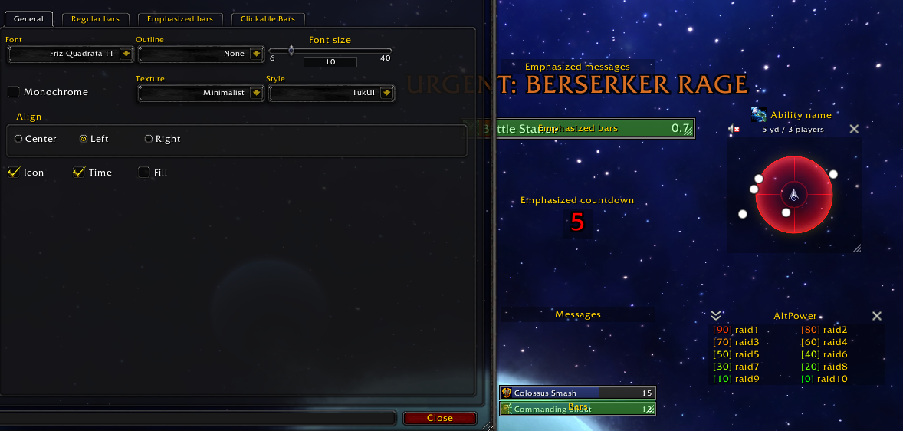
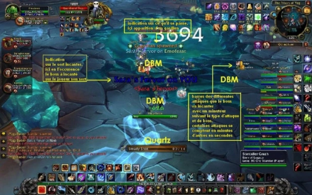
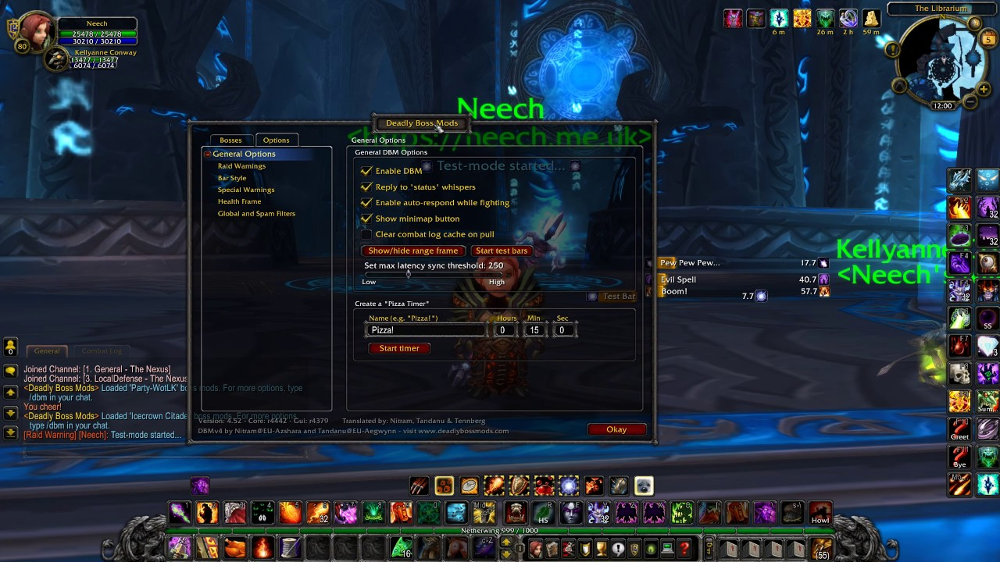
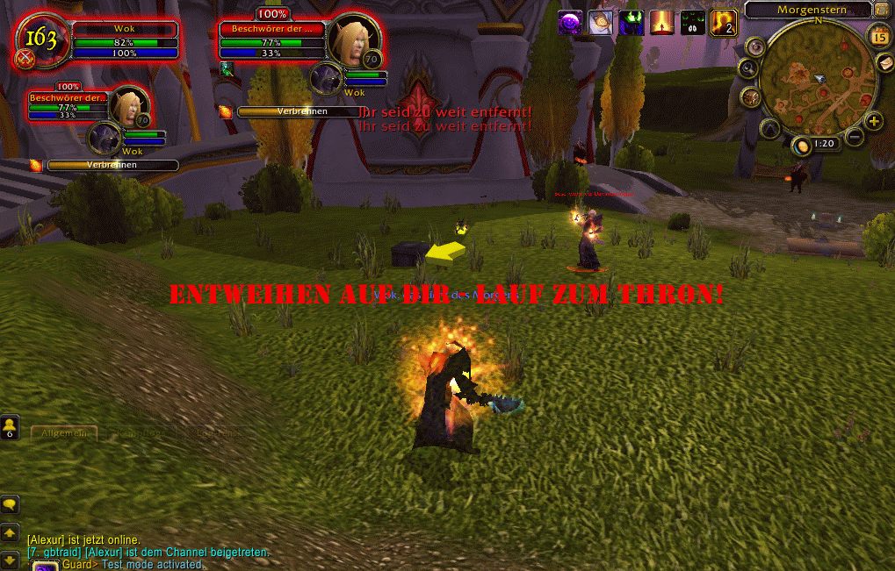
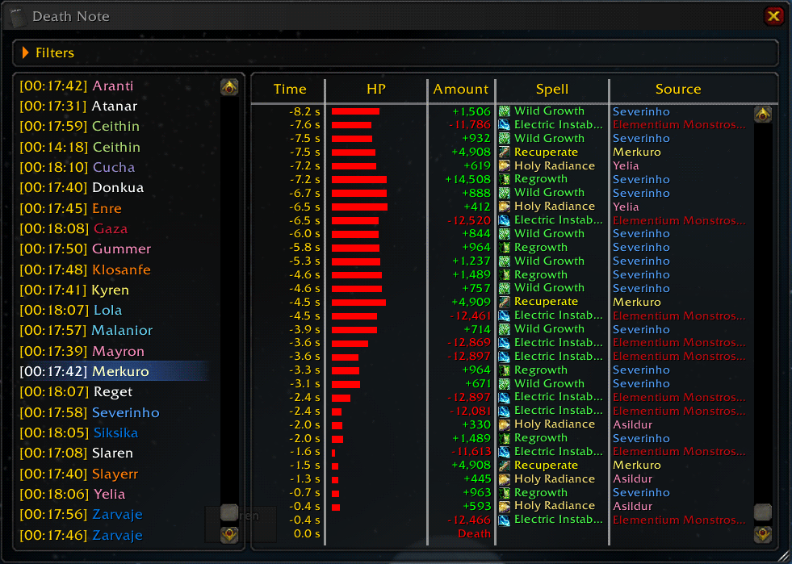
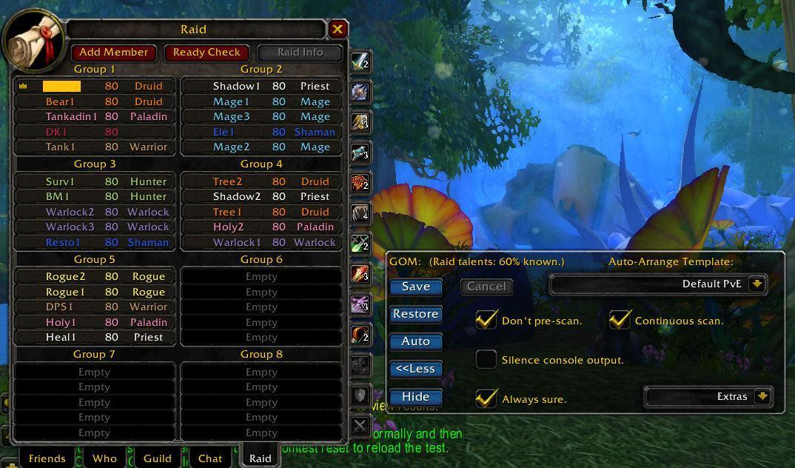
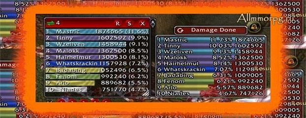
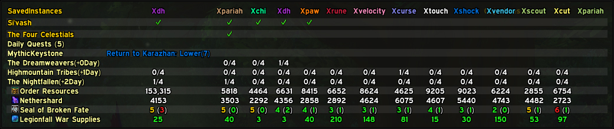

# Aide aux boss

## AtlasLoot


Conseillé et validé par l'équipe !


AtlasLoot Classic est une interface qui permet de parcourir les tables de butin des boss à tout moment pendant le jeu.

**Caractéristiques**

* Complète tables de butin pour les donjons et raids de la version Classique
* Artisanat avec des informations sur les matériaux, les objets créés et les niveaux d'habileté
* Les factions
* Collections entières des ensembles d'objets PVP et Tiers 0 -&gt; Tiers 3.

Vous avez également l’ajout de vos objets favoris dans une liste de favoris avec « ALT + Clic gauche ».



## Big Wigs

BigWigs est un module complémentaire de rencontre. Il se compose de nombreux scripts de rencontre individuels, ou modules de boss, des mini add-ons qui sont conçus pour déclencher des messages d'alerte, des barres de minutage, des sons, etc. pour une rencontre de raid spécifique.



## DBM core-and-wotlk-mods


Conseillé et validé par l'équipe !


**Deadly Boss Mods \(DBM\) :** Une interface dédiée aux raids, donjons, événements spéciaux qui vous aides dans les stratégies et phases de chaque boss. L'ultime aide à la rencontre pour vous donner des informations de combat faciles à traiter en un coup d'œil. DBM vise à se concentrer sur ce qui vous arrive et sur ce que VOUS devez faire pour y remédier.


Cette version de DBM ne contient que l'assistance pour WOTLK  
Voir la version [BC+Classic](https://addons.way-of-elendil.fr/aide-aux-rencontres-pve#dbm-bc-and-vanilla-mods)




## DBM bc-and-vanilla-mods


Conseillé et validé par l'équipe !


L'ultime aide à la rencontre \(pour le commerce de détail\) pour vous donner des informations de combat faciles à traiter en un coup d'œil. DBM vise à se concentrer sur ce qui vous arrive et sur ce que VOUS devez faire pour y remédier.


Cette version de DBM ne contient que l'assistance pour BC + Classic  
Voir[ la version TLK ](https://addons.way-of-elendil.fr/aide-aux-rencontres-pve#dbm-core-and-wotlk-mods)




## defileguard

Cet addon fournit plusieurs messages d'avertissement spéciaux pour le défilé du roi-liche en mode 25er hard. Les messages sont affichés en vert, rouge ou orange. Des sons supplémentaires sont joués pour aider le joueur.



## fatality

Fatality est un simple addon de rapport de décès qui annonce les informations sur le\(s\) dernier\(s\) coup\(s\) qu'une personne a pris avant de mourir.



## Group O Matic

Le groupe O Matic permet au chef de raid de mettre en place plus facilement l'organisation du groupe. Il permet de sauver et de rétablir les groupes dans lesquels les gens se trouvent.

Il est également doté d'un bouton Auto, qui permet de pousser tout le monde vers le haut, ou de regrouper les participants en mêlée, ou encore de diviser le groupe en groupes impairs ou pairs, ou d'autres choses encore. L'action du bouton Auto est définie par le menu "modèle d'organisation automatique".



## Omen

Omen est un compteur de menaces. Les ennemis de WoW décident qui attaquer en décidant qui est le plus menaçant en fonction des capacités que vous utilisez. Omen fournit des valeurs précises du niveau de menace relatif de votre groupe sur les ennemis individuels, afin que vous puissiez voir quand vous risquez d'attirer les ennuis \(ou, si vous êtes le prochain sur la liste d'aggro si votre tank meurt\). Cette information n'est généralement critique que dans les raids, où seuls les tanks peuvent survivre aux agressions, mais elle est utile dans beaucoup d'autres situations multi-joueurs



## SavedInstances

Un addon qui garde une trace des verrouillages d'instance/raid enregistrés contre vos personnages, ainsi que des devises et des recharges associées. 



