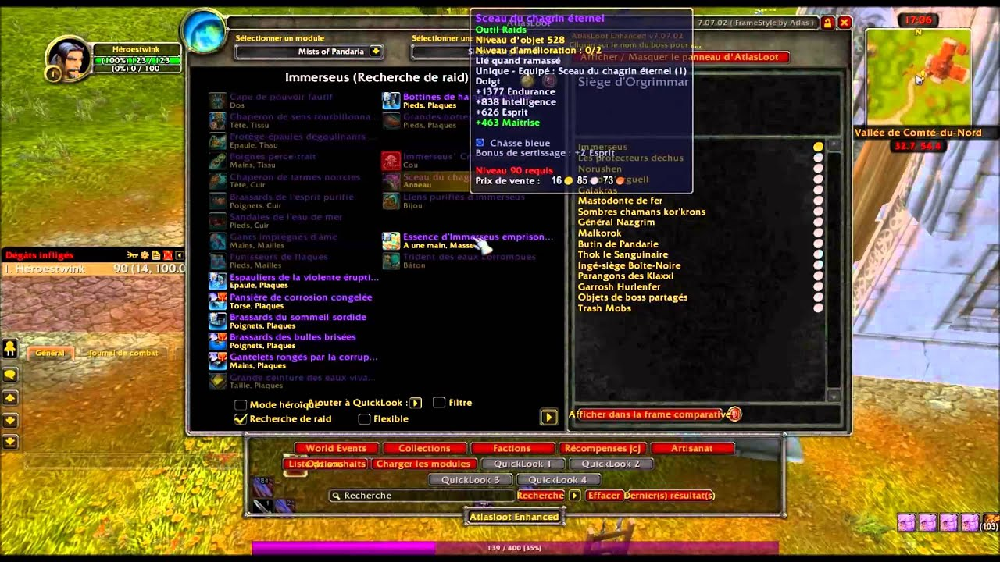

# Aide aux boss

## AtlasLoot

AtlasLoot Classic est une interface qui permet de parcourir les tables de butin des boss à tout moment pendant le jeu.

**Caractéristiques**

* Complète tables de butin pour les donjons et raids de la version Classique
* Artisanat avec des informations sur les matériaux, les objets créés et les niveaux d'habileté
* Les factions
* Collections entières des ensembles d'objets PVP et Tiers 0 -&gt; Tiers 3.

Vous avez également l’ajout de vos objets favoris dans une liste de favoris avec « ALT + Clic gauche ».



## Big Wigs



## Classloot



## dbm-bc-and-vanilla-mods



## dbm-core-and-wotlk-mods



## defileguard



## fatality



## groupomatic



## omen



## savedinstances



