# Buffs & Debuffs

## ClassTimer

Il s'agit d'un addon permettant de créer des timers pour vos propres buffs et debuffs.

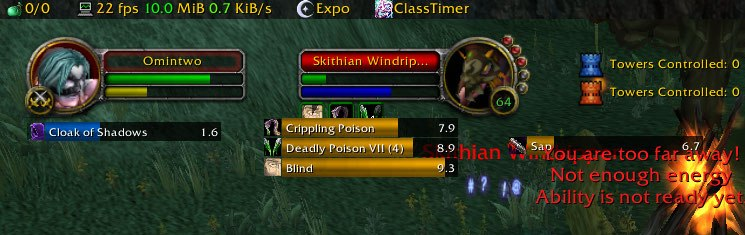



## DebuffFilter

Cet addon filtre les debuffs et les buffs dont vous ne vous souciez pas, et les place n'importe où sur l'écran. Si vous êtes une classe de mêlée, vous pouvez tout filtrer sauf CoR, FF et Sunder. Si vous êtes un lanceur, vous pouvez simplement afficher les déboutures comme CoE et Winter's Chill. Les guérisseurs peuvent tout filtrer sauf leurs buffs et HoTs, etc.

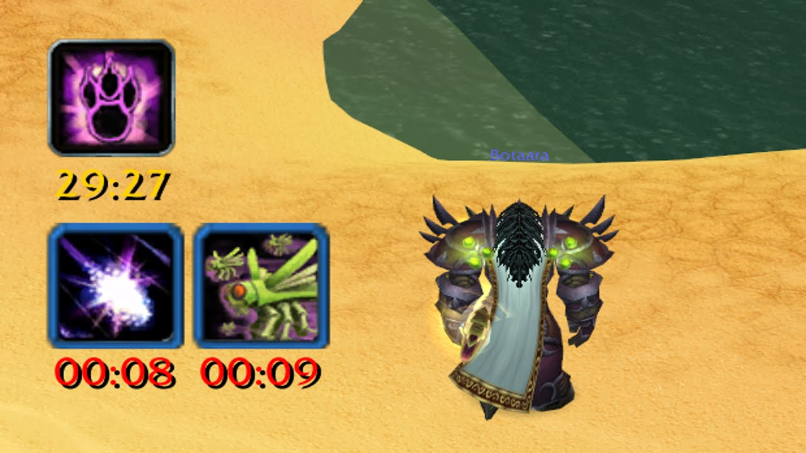



## Decursive


Conseillé et validé par l'équipe !


Decursive vérifie sur tout votre groupe/raid si un membre est affecté par un débuff \(effet négatif\) que votre classe est capable de soigner \(magie, maladie, malédiction, etc\).

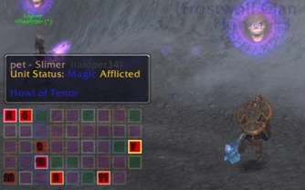



## DotTracker

DotTracker est conçu pour ne pas vous déranger lorsque vous vous connectez à un personnage d'une classe qu'il ne suit pas. Ainsi, vous n'avez plus à activer ou désactiver un addon chaque fois que vous changez de personnage. DotTracker stocke les paramètres par spécification pour chaque toon, vous pouvez donc concevoir des configurations pour chaque spécification pour chaque personnage.

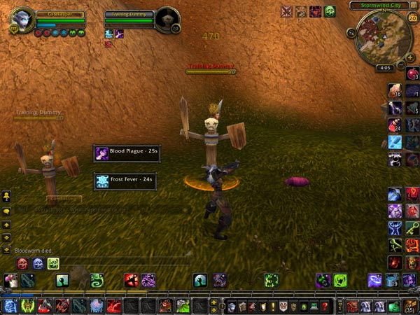



## Elkano's BuffBars

EBB fournit des groupes d'indicateurs de style barre d'état pour montrer les \(dé\)buffs qui affectent actuellement votre personnage ou certaines autres unités \(actuellement focus, animal de compagnie et cible\). Pour le joueur, il peut également afficher des indicateurs pour les enchantements temporaires placés sur ses armes.

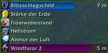



## EventAlert

L'addon vous avertira au milieu de votre écran par une icône, le nom du sort qui a procuré, le temps restant sur le proc et fera un son subtil. EventAlert est également capable de gérer plus d'un proc à la fois.

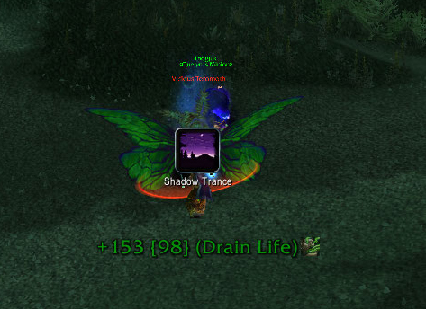



## ForteXorcist

ForteXorcist est un puissant addon pour... Tout le monde ! Il vous fournit de nombreux outils utiles pour rendre le jeu de votre personnage plus facile et plus amusant.

* Minuteur de sorts 
* Minuterie de refroidissement 
* Messages d'autodéfense et de raid, sons d'alerte et plus

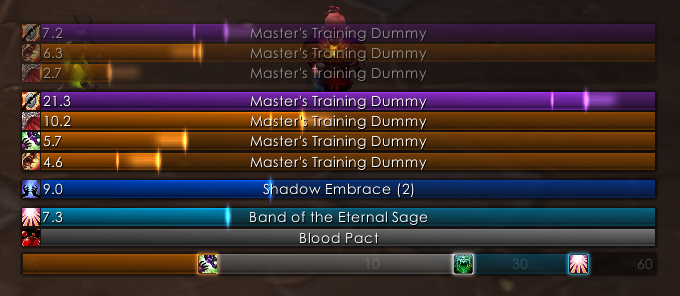



## Healium

Healium est un addon de World of Warcraft dont le but principal est de simplifier la guérison des membres d'un groupe ou d'un raid.

Healium offre une interface personnalisable et intuitive, optimisée pour faciliter la guérison. Healium vous permet de placer n'importe quel sort, objet ou macro sur les boutons situés juste à côté de la barre de santé de chaque personne. Les boutons jetteront le sort sur la personne à côté de laquelle ils se trouvent, sans que vous ayez besoin de cibler la personne en premier.

Les barres de santé des joueurs sont compactes et proches les unes des autres, ce qui réduit l'espace sur l'écran que vous devez regarder pour surveiller la santé de la personne. Les boutons de sorts sont très proches les uns des autres, ce qui réduit l'espace dont vous disposez pour déplacer votre souris, et donc le temps nécessaire pour lancer le sort.

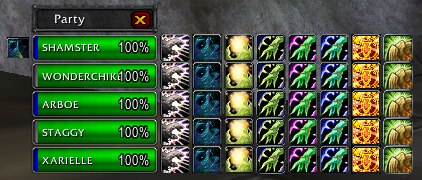



## NeedToKnow

NeedToKnow vous permet de surveiller des buffs, débuffs, cooldowns et totems spécifiques sous forme de barres de minutage qui apparaissent toujours à un endroit cohérent sur votre écran.

NeedToKnow est particulièrement utile pour surveiller les buffs, debuffs et cooldowns fréquemment utilisés. Un chevalier de la mort pourrait l'utiliser pour suivre ses propres maladies sur une foule

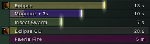



## PallyPower

Pally Power Classic est basé sur la version 3.0 de l'époque de Wrath of the Lich King. Cet add-on fournit une interface interactive et facile à utiliser qui vous permet de définir vos propres bénédictions \(Furie vertueuse, Aura, Sceau et Bénédictions\) et vérifie automatiquement les buffs manquants avec un indicateur facile à lire. Pendant une fête ou un RAID, le pouvoir de Pally peut être utilisé pour attribuer des bénédictions à d'autres paladins. Pour ce faire, les autres paladins devront également utiliser le Pouvoir de rassemblement et le paladin chargé de ces tâches devra être le chef du groupe, le chef du raid ou l'assistant du raid. Les camarades paladins peuvent sélectionner le paramètre "Affectation libre" pour permettre à d'autres non chefs de modifier votre affectation de bénédiction. En combat, aucune des affectations ne peut être modifiée en raison du verrouillage en cours de combat.

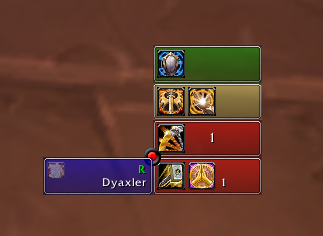



## Power Auras

Cet AddOn power auras a été créé afin d'avoir une meilleure visibilité lorsque l'on acquière des buffs ou des débuffs. Très utile principalement pour les buffs ou débuffs court, il permet d'avoir au centre de l'écran, ou autour de son personnages, des effets visuels extrêmement paramétrables, plutôt que tout le temps avoir à regarder si on a l'icône du buff ou débuff sur les bords de l'écran.

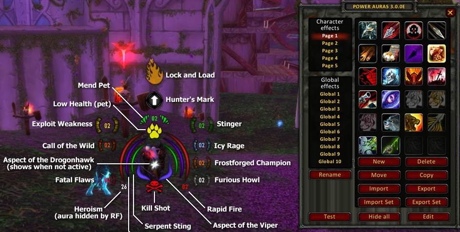



## SatrinaBuffFrame

Caractéristiques vedettes de Satrina Buff Frame :

* Jaunes et les affaiblissements dans tout nombre de cadres mobiles
* Durée des minuteries avec plusieurs options de format \(plus aucune option minuterie\)
* Buff bars peuvent être activés dans n'importe quel cadre
* Enchantements d'armes temporaires sont affichées dans le cadre Buff principal
* Avertissements expiration Buff, settable par image avec des choix multiples pour savoir quand déclencher des avertissements, et quelle est la durée d'avertissements Buff apparaîtra pour
* Options pour un son d'accompagnement pour l'alerte d'expiration

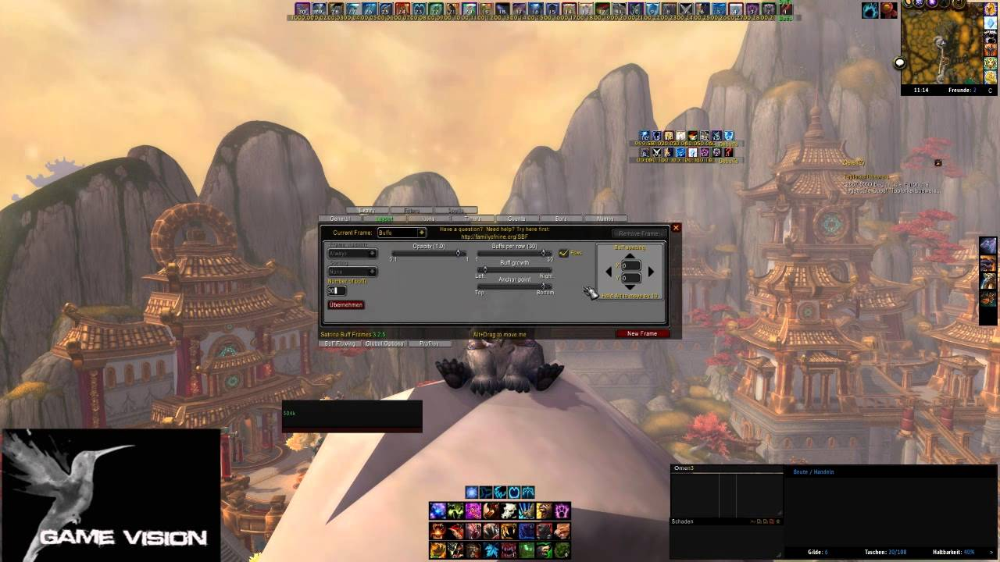



## SkillMonitor

SkillMonitor affiche une barre de progression qui montre l'évolution d'une compétence sélectionnée. Disons que vous venez de décider de passer au niveau de la pêche. Plus besoin d'ouvrir constamment la fenêtre de votre profession pour vérifier vos progrès ! Il vous suffit de cliquer avec le bouton droit de la souris sur la barre de progression, de sélectionner Pêche dans le menu contextuel de SkillMonitor et vous verrez une barre de progression qui s'actualise à mesure que vous gagnez en compétence.

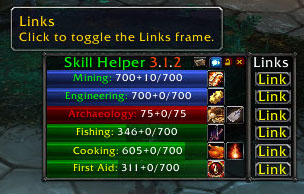



## TellMeWhen

TellMeWhen est un addon WoW qui fournit des notifications visuelles, auditives et textuelles sur les cooldowns, les buffs et presque tous les autres éléments du combat. 

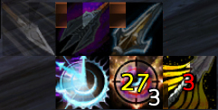



## WeakAuras 2

WeakAuras est un cadre puissant et flexible qui permet l'affichage de graphiques hautement personnalisables sur l'interface utilisateur de World of Warcraft pour indiquer les buffs, les débuffs et d'autres informations pertinentes. Cet addon a été créé pour remplacer légèrement les Power Auras, mais a depuis introduit plus de fonctionnalités tout en restant efficace et facile à utiliser.

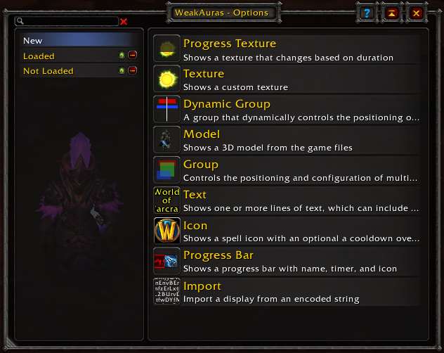



## Whammy

Whammy est un complément de WoW qui permet aux joueurs de pointer et de cliquer sur Buff, Heal, Decurse, d'exécuter des macros et bien plus encore. Toutes les fonctions sont associées à des clics de souris et peuvent être entièrement personnalisées.

Whammy vous avertit lorsqu'un autre joueur a besoin d'être décurci ou dispensé. Il dispose également d'un état de santé pour les membres de votre groupe ou de votre raid et vous avertira en cas de problème de santé.

Whammy dispose également d'une fenêtre de statut de groupe, indiquant l'état de santé total et le mana du groupe ou du raid.

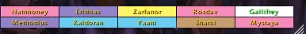



