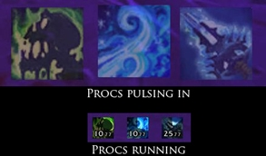

# Classes

## Acherus

Acherus est un addon du chevalier de la mort, qui fournit des présentoirs pour les runes, les procs, le pouvoir runique et les maladies. Un grand effort a été fait pour rendre toutes les fonctionnalités personnalisables. Des animations sont fournies pour qu'il soit très facile de voir quand les choses deviennent disponibles et indisponibles.



## AssassinTimer



## DruidStats



## HealBot


Conseillé et validé par l'équipe pour tous les soigneurs incompétents !


En plus d'être l'addon favoris des soigneurs les plus handicapés, healbot peut également être utilisé en qualité d'interface de raid. Moins discrète qu'une Grid, celle-ci affiche de manière claire et précise les informations utiles aux soigneurs tels que les soins en cours sur un membre ou encore les joueurs à guérir en priorité.



## Healers-Have-To-Die



## LearningAid



## MageFever



## MageNuggets



## Necrosis



## PortalBox



## ShockAndAwe



## Talented



## TrainerSkills



## Warrior Vigilance Tracker



