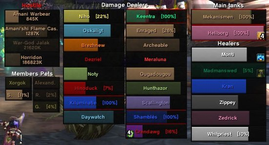

# Classes

## Acherus

Acherus est un addon du chevalier de la mort, qui fournit des présentoirs pour les runes, les procs, le pouvoir runique et les maladies. Un grand effort a été fait pour rendre toutes les fonctionnalités personnalisables. Des animations sont fournies pour qu'il soit très facile de voir quand les choses deviennent disponibles et indisponibles.


Acherus


## AssassinTimer


AssassinTimer


## DruidStats


DruidStats


## HealBot


Conseillé et validé par l'équipe pour tous les soigneurs incompétents !


En plus d'être l'addon favoris des soigneurs les plus handicapés, healbot peut également être utilisé en qualité d'interface de raid. Moins discrète qu'une Grid, celle-ci affiche de manière claire et précise les informations utiles aux soigneurs tels que les soins en cours sur un membre ou encore les joueurs à guérir en priorité.


HealBot


## Healers-Have-To-Die


Healers-Have-To-Die


## LearningAid


LearningAid


## MageFever


MageFever


## MageNuggets


MageNuggets


## Necrosis


Necrosis


## PortalBox


PortalBox


## ShockAndAwe


ShockAndAwe


## Talented


Talented


## TrainerSkills


TrainerSkills


## Warrior Vigilance Tracker


WarriorVigilanceTracker

