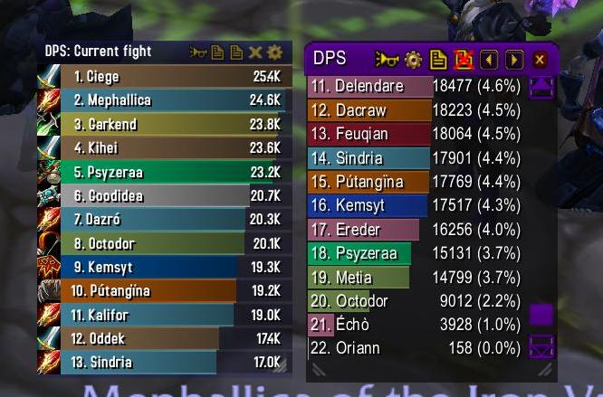

# Combat

## Combo Points Redux



## CustomCombatText



## GTFO



## MikScrollingBattleText

Mik Scrolling Battle Text peut afficher à l'écran toutes sortes d'informations, comme les dégâts et effets reçus ou infligés, les lancements de sorts des joueurs autour de vous, la fin de vos temps de recharge et bien d'autres choses.



## NiceDamage



## Parrot



## RangeDisplay

Cet addon est très simple il affiche clairement à quelle distance d’une cible vous vous trouvez. C’est extrêmement utile pour les attaquants afin qu’ils puissent garder la distance maximum, ou pour les raiders qui sont tenus à une distance spécifique loin du patron afin d’assurer la réussite du raid. 

Range Display peut être configuré pour montrer votre gamme actuelle de votre cible, votre animal de compagnie, votre cible de discussion, et des unités de passage de la souris. Vous pouvez également configurer la façon dont la distance est affichée sur votre écran, y compris l’établissement de sa position en ajoutant une couleur de bordure ou de l’arrière-plan.



## Recount


Conseillé et validé par l'équipe !


Aussi discret qu'utile, recount est un addon que tout le monde se doit de posséder. Il enregistre les statistiques détaillées de chaque combat. Vous pourrez le consulter et récupérer des informations essentielles telles que votre score de dégât, de soin ou encore les statistiques des autres membres du groupe. Le combatlog \(fenêtre listant les actions de combat récentes\) le plus complet pour l'instant.



## ScrollingCombatText



## Skada



## TankTotals



