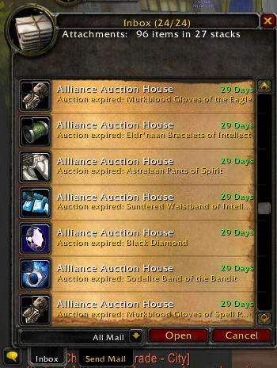
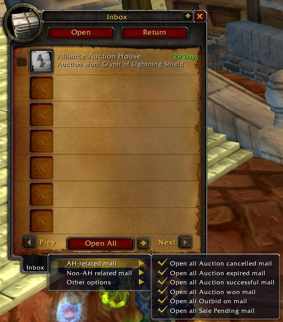

# Courriers

## Better Inbox

BetterInbox remplace la boîte de réception par défaut de Blizzard par une boîte de réception à défilement avec quelques fonctionnalités supplémentaires.

* Résumé des factures, des pièces jointes et de l'or en haut.
* Dropdown intégré pour sélectionner ce qui doit être ouvert, tout le courrier, tous les articles, tout l'or.
* Sélectionnez certains courriers par une case à cocher et ouvrez les courriers, les articles ou l'or sélectionnés

La fonction "Tout ouvrir" peut encore comporter quelques bizarreries avec des jetons de champ de bataille que vous ne pouvez pas prendre.



## Postal

Une extension de l'interface de courrier électronique de Blizzard qui

Ouvre automatiquement le courrier, très rapidement Envoyer plusieurs articles à la fois, très rapidement Autocomplète les noms incluant les alts dans une liste déroulante

* _Cliquez à droite_ sur les objets de la boîte de réception pour piller l'or, piller l'objet et détruire la lettre, dans cet ordre, le cas échéant. 
* _Clic droit_ ou _Gauche_ pour ajouter des objets d'inventaire aux pièces jointes. 
* Cliquez sur le bouton droit pour ajouter des objets d'inventaire dans le cadre des échanges.

Le nom postal a été repris de l'homonyme du commerce car il s'agissait à l'origine d'une modification de GMail qui était le prédécesseur de cet addOn. La plus grande partie du code est cependant consacrée à l'onglet d'envoi et serait plus précisément décrite comme un backport partiel de l'interface blizzard du commerce de détail.



