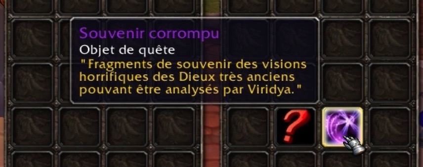

# Fixer le point d'interrogation rouge sur les items dans vos sacs

ix Item Icon


Conseillé et validé par notre équipe


Ce plugin permet tout simplement d'afficher les images des objets custom dans votre inventaire crées par exemple lors des événements spéciaux ou encore pour la transmogrification.




Cet addon n'est pas compatible avec Elvui \(il n'aura aucun effet\).


