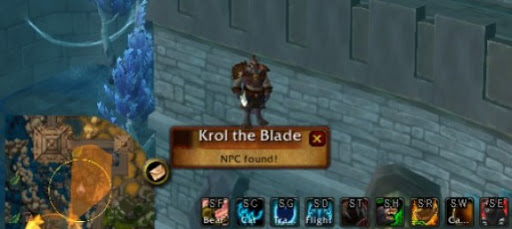

# Hauts-faits

## AutoGratzer


AutoGratzer


## GutPet

Cet addon liste toutes les montures et mascottes selon les critères définis



## NPCScan


Conseillé et validé par l'équipe !


NPCScan est un addon qui vous averti lorsqu'un monstre rare est proche de vous. Il permet notamment d'achever les hauts faits nécessitant de tuer des monstres rare et difficile à trouver. Add-on discret qui ne se manifeste que lorsqu'il repère un monstre de ce type. npc scan


NPCScan


## Overachiever



## Silver Dragon



## Raid Achievement


