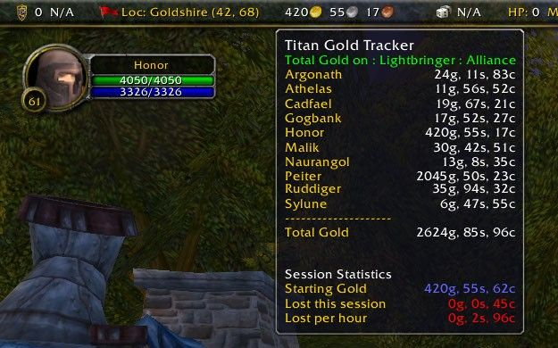

# Interface

## Align



## AscEnchantList



## AscensionElvUI



## ButtonFacade

Cet addon permet de modifier l'aspect des icones des barres d'action et des buffs/debuffs. Il est nécessaire d'utiliser certains addons pour modifier l'aspect des icones \(par exemple Bartender4, SatrinaBuffFrame, BlizzFacade,...\).



## CleanUI



## DeathKoilUI



## ElvUI



## ElvUI SmartQuestTracker



## FuBar



## IceHUD

IceHUD est un add-on de combat, en effet celui-ci crée deux sphères verticale autour de votre personnage. Celle-ci vous indique vos niveaux de vies, mana, rage, puissance runique ou énergie selon votre classe. Dés que vous ciblez un autre personnage, deux sphères se rajoutent vous indiquant les mêmes informations que pour vous même. L'addon calcul aussi votre latence durant un cast, ainsi vous pouvez anticiper le lag entre vous et le serveur, ce qui vous fera gagner de précieuse micro-seconde. D'autres fonctionnalités sont disponibles, le seul problème reste dans l'interface de configuration qui est entièrement en anglais.



## kgPanels



## LUI



## MerathilisUI



## MoveAnything

Move Anything vous aide à personnaliser votre environnement en vous permettant de déplacer et/ou de cacher certains "module" \(portrait, sac, fenetre etc...\) Il est directement accessible via l'onglet MoveAnything de votre menu principal \(touche ESC\).



## nUI



## oUF



## Skinner

Un puissant modificateur de texture pour l'interface de wow. Personnaliser vos boites de dialogues, inventaire, menus, etc, avec les couleurs textures et formes qui vous conviennent.



## SpartanUI

Spartan UI est, comme son nom le laisse supposer, un modificateur d'interface. A la fois discret, pratique et bien foutu, cet addon aujourd'hui encore peu connu est idéal pour le débutant désireux de se lancer dans le modelage d'interface. A essayer de toute urgence !



## TitanPanel


Conseillé et validé par l'équipe !


Titan Panel est une barre qui se place au dessus du jeu \(voir screenshot ci-contre\), elle permet notamment de calculer le temps restant avant le passage d'un level \(calculé sur la moyenne d'XP que vous récoltez\), elle vous indique le degré de durabilité de votre stuff, le nombre de place restant dans votre sac,... bref une multitude d'information et de statistique sont présente sur cette barre, qui est plus un gadget qu'un add-on obligatoire.



## Volumizer



## XPerl

X-Perl est un addon d'interface qui permet de modifier l'affichage de votre portrait, ainsi que celui des membres de votre groupe.



