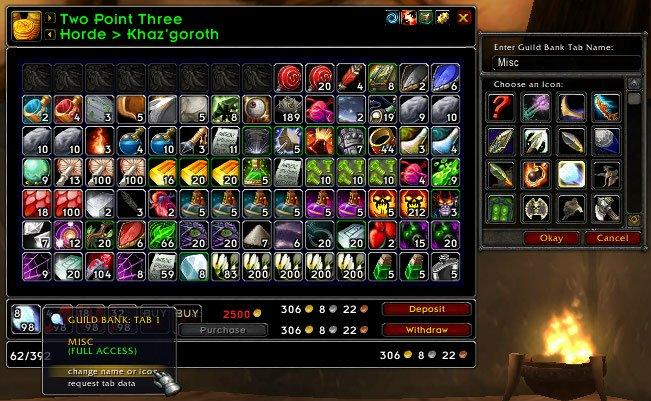
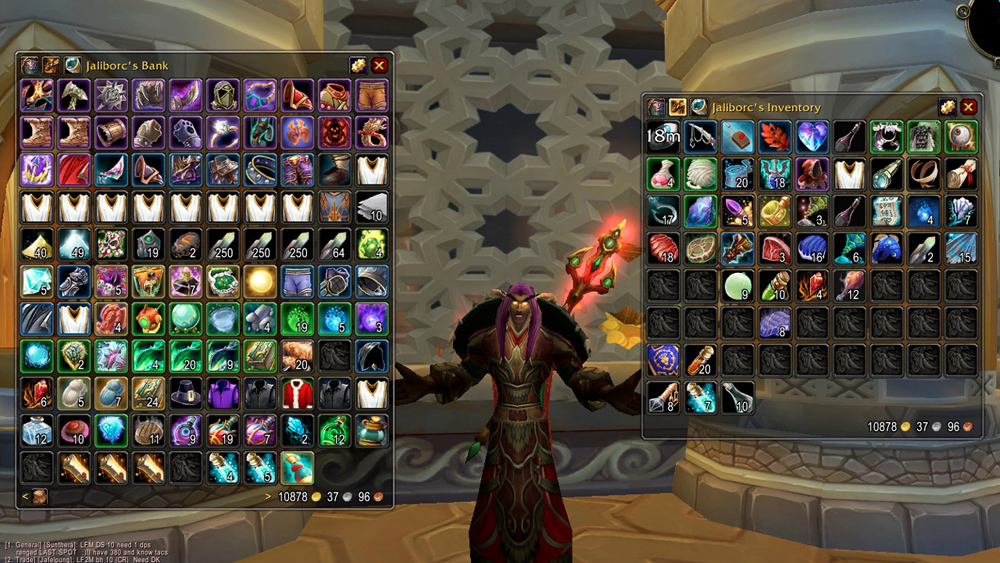
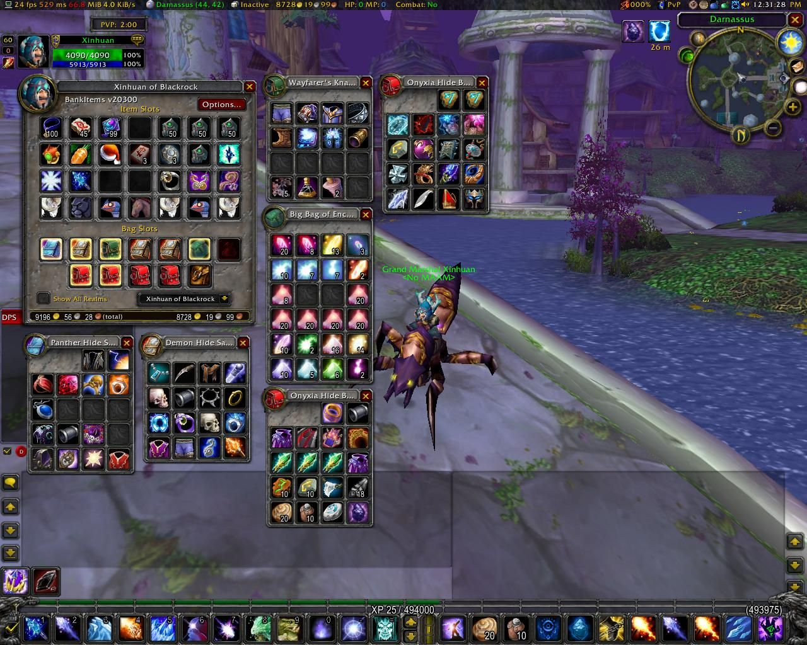

# Inventaire

## adibags



## altoholic



## ArkInventory

Léger et facile à configurer, cet addon vous permet de créer des catégories de sacs et offre ainsi une meilleure lisibilité de votre inventaire. De plus, chaque nouvel objet sera automatiquement assigné à un sac selon sa catégorie.



## AutoMaton

Vend tout les objets "gris" de votre inventaire, paramétrable pour un meilleur confort de jeu.

## AutoRepair



## AutoVendor



## baggins



## Bagnon 2


Déconseillé par l'équipe : Provoque des **problèmes visuels** de disparition d'objets lorsque l'addon est mal configuré. \(_Il suffit de le désactiver pour revoir ses items disparus\)._


Bagnon est un addon bien pratique réunissant tous vos sacs ainsi que ceux de votre banque en un seul. Cette dernière est même consultable où que l'on soit via l'interface de Bagnon.



## bagnonscrap



## bagsaver



## bagsync



## bankitems

Vous avez bien envie de vous crafter un item, vous êtes presque sûr que votre reroll a les composants adéquats sans pour autant en être sûr... Inutile de déco/reco, Bank Item vous permettra de voir les sacs à dos et emplacements de banque de tous vos personnages sur n'importe quel serveur, et ce où que vous soyez.



## bankstack



## baudbag



## baudmanifest



## bidbot



## combuctor



## crapaway



## dropthecheapestthing



## dumpster



## farmit2



## fbagofholding



## gbanker



## genie



## guildbanksearch-7.2.0.1



## guildbanksearch-8.0.0.0



## guildbanksearch



## iguard



## itemguard



## itemlink



## jpack



## karnicrap



## krestack



## linkepedia



## lootdb



## looter



## lootfilter



## ludwig



## ludwig2



## mobilevault



## mrplow



## muchmoremunch



## neatfreak



## oglow



## onebag



## onebank



## outfitter



## passloot



## scrap



## sellgrey



## selljunk



## sellomatic



## sellomatic2



## superloot



## sushisort



## tbag



## trashcan



## uberinventory



## vault



## xloot

Xloot en dépit de modifier le skin de votre fenêtre de loot, il vous permet d'ajouter des options pour ce dernier.

* Il permet d'afficher la fenêtre de loot directement sous votre souris.
* Il permet d'afficher sur les canaux dire, chuchotement, crier, guilde, groupe, general etc... vos/votre loot\(s\).

 Pour afficher la petite fenêtre d'options, clique-droit sur "montrer tout..." en dessous des loots.



## xlootmonitor



