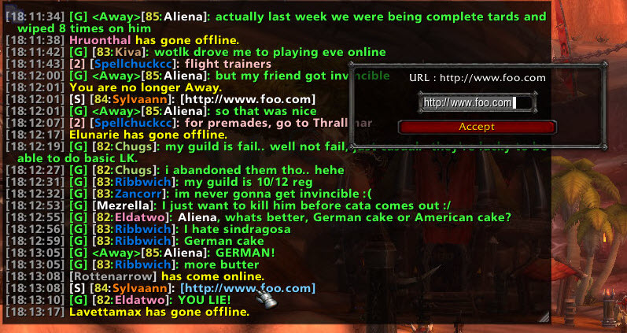
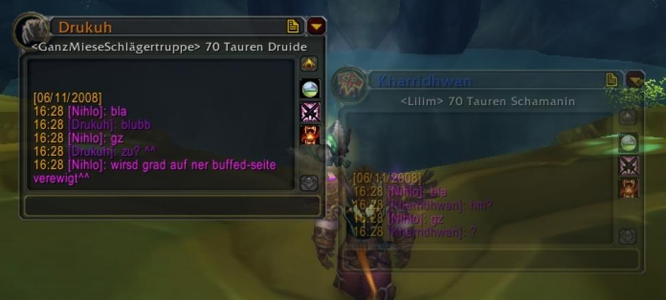

# Macros, Chat & Communication

## AdvancedIconSelector



## BadBoy



## BadBoy CCleaner



## BadBoy Guilded



## BadBoy Levels



## BindPad



## Cellular

Cellular est un addon de chat qui s'active dès lors que vous recevez en message, en effet vous ne voyez plus votre message dans la zone de chat habituel, mais dans une nouvelle fenêtre, celle-ci est entièrement paramétrable, parmi ces modifications cellular propose de modifier la police, la taille, l'image de fond, la couleur de fond, ...



## CensusPlus



## Chat Mod

ChatMOD est un addon qui permet de configurer votre interface de discussion. En effet il permet une multitude de modification, tel : colorer les noms des joueurs selon leur classe lorsqu'il discute, déplacer la zone de saisie au dessus du chat, rendre les url cliquable, afficher le niveau d'un joueur, implanter l'heure d'envoie de chaque message, ... Taper /chatmod pour configurer l'addon comme bon vous sembles



## Chatter

Chatter est un addon complet, léger et méga configurable de mise à niveau du chat. Il prend en charge tout un tas d'options comme le highlight sur mots clés, l'historique de conversation, le clic sur les urls, le changement de couleur pour certains canaux ou joueurs, l'auto groupe lorsqu'un joueur écrit "groupe", et plein d'autres fonctionnalités.



## IgnoreMore



## MacroBank



## MacroForm



## Prat


Conseillé et validé par l'équipe !


Prat modifie la fenêtre de discussion à l'aide d'une trentaine de petits modules indépendants. Plus facile d'accès qu'il n'y parait, cet addon permet également de changer la police des messages, tout en ajoutant l'heure à laquelle les messages sont reçus, le niveau et la classe \(sous forme de couleur\) de notre interlocuteur.



## SpamThrottle



## SuperDuperMacro



## WoW Instant Messenger

WIM alias wow instant messenger n'est ni plus ni moins qu'un MSN adapté à WoW. Il est possible d'enregistrer les conversations, d'avoir une fenêtre par dialogue, etc.



