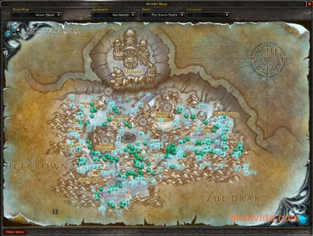

# Métiers

## Ackis Recipe List


Conseillé et validé par l'équipe !


Ackis Recipe List est un addon qui analyse vos métiers et fournit des informations sur la façon d'obtenir les recettes manquantes.


AckisRecipeList


## AdvancedTradeSkillWindow


AdvancedTradeSkillWindow


## Bloodhound


Bloodhound


## EnhancedTradeSkillUI


EnhancedTradeSkillUI


## EriksShoppingList


EriksShoppingList


## FishermansFriend


FishermansFriend


## FishingAce


FishingAce


## FishingBuddy


FishingBuddy


## FishWarden


FishWarden


## Gatherer


Conseillé et validé par l'équipe !


Gatherer est un addon particulièrement utile aux herboristes et mineurs ainsi qu'aux chasseurs de trésors.


Gatherer


## GatherMate

Enregistrez l'emplacement des gisements, herbes et trésors que vous trouverez au cours de l'aventure grâce à GatherMate. Digne descendant de feu Gatherer, cet add-on recensera automatiquement les "spots" de farm sur lesquels vous cliquerez. Ainsi, vous saurez où et quoi chercher à tout moment. N'oubliez pas de télécharger GatherMate\_Data pour une efficacité optimale.


GatherMate


## GatherMate Data

Si vous profitez déjà des vertus de GatherMate, jetez-vous sans attendre sur GatherMate\_Data. Il s'agit d'un plug-in offrant une base de donnée très complète à GatherMate. Dorénavant, votre carte affiche tous les "spots" de farm (gisements, herbes et trésors) où qu'ils soient dans le monde. A vous l'orgie de minerais et de plantes


GatherMate Data


## GemCensus


GemCensus


## GemHelper


GemHelper


## GnomeWorks


GnomeWorks


## Jigsaw


Jigsaw


## KevToolQueue


KevToolQueue


## MillHelp


MillHelp


## Molinari


Molinari


## MrTrader


MrTrader


## Multitracker


Multitracker


## Panda


Panda


## Producer


Producer


## ProfessionsBook


ProfessionsBook


## ProfessionsVault


ProfessionsVault


## RecipeBook


RecipeBook


## RecipeRadar


RecipeRadar


## ScrollMaster


ScrollMaster


## Sifter


Sifter


## SimpleTradeskill


SimpleTradeskill


## Skillet


Skillet


## Tracking-Cycler


Tracking-Cycler


## TrackingChanger


TrackingChanger


## TrackingPlus


TrackingPlus


## TradeSkillDW


TradeSkillDW


## TradeskillHD


TradeskillHD


## TradeskillInfo


TradeskillInfo

