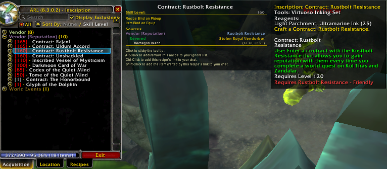

# Métiers

## Ackis Recipe List


Conseillé et validé par l'équipe !


Ackis Recipe List est un addon qui analyse vos métiers et fournit des informations sur la façon d'obtenir les recettes manquantes.



## AdvancedTradeSkillWindow



## Bloodhound



## EnhancedTradeSkillUI



## EriksShoppingList



## FishermansFriend



## FishingAce



## FishingBuddy



## FishWarden



## Gatherer


Conseillé et validé par l'équipe !  
A cumuler avec GatherMate & GatherMate Data pour le combo ultime 


Gatherer est un addon particulièrement utile aux herboristes et mineurs ainsi qu'aux chasseurs de trésors.



## GatherMate

Enregistrez l'emplacement des gisements, herbes et trésors que vous trouverez au cours de l'aventure grâce à GatherMate. Digne descendant de feu Gatherer, cet add-on recensera automatiquement les "spots" de farm sur lesquels vous cliquerez. Ainsi, vous saurez où et quoi chercher à tout moment. N'oubliez pas de télécharger GatherMate\_Data pour une efficacité optimale.



## GatherMate Data

Si vous profitez déjà des vertus de GatherMate, jetez-vous sans attendre sur GatherMate\_Data. Il s'agit d'un plug-in offrant une base de donnée très complète à GatherMate. Dorénavant, votre carte affiche tous les "spots" de farm \(gisements, herbes et trésors\) où qu'ils soient dans le monde. A vous l'orgie de minerais et de plantes



## GemCensus



## GemHelper



## GnomeWorks



## Jigsaw



## KevToolQueue



## MillHelp



## Molinari



## MrTrader



## Multitracker



## Panda



## Producer



## ProfessionsBook



## ProfessionsVault



## RecipeBook



## RecipeRadar



## ScrollMaster



## Sifter



## SimpleTradeskill



## Skillet



## Tracking-Cycler



## TrackingChanger



## TrackingPlus



## TradeSkillDW



## TradeskillHD



## TradeskillInfo



