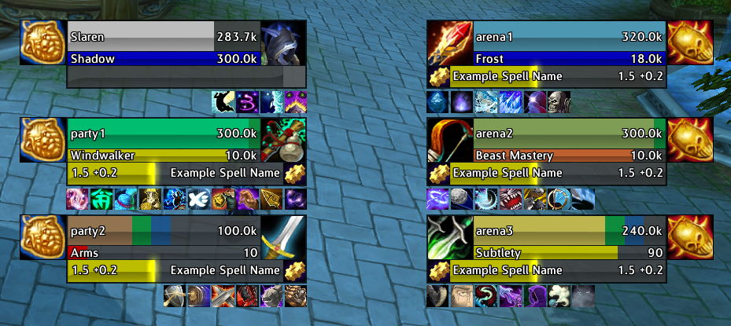
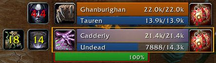

# PvP

## Capping Battleground Timers

Capping est un petit add-on permettant de savoir le temps qu'il reste avant qu'un drapeau ne soit capturé en champs de bataille. Il se présente sous la forme de petites barres de couleurs - bleu pour l'Alliance, rouge pour la Horde.


Capping Battleground Timers


## Diminish (DR Tracker)

Indicateurs et minuteries sont mis à jour quand un CC se termine, pas lorsqu'elle est appliquée. diminish


Dimminish


## Doom Cooldown Pulse

Vous avez toujours voulu savoir quand une certaine capacité sera à nouveau disponible après l'avoir utilisée, mais vous êtes trop pris dans un combat pour y faire attention? Doom Cooldown Pulse est conçu pour résoudre ce problème! Il clignote sur l'icône de la capacité dans le milieu de votre écran à chaque fois qu'il devient de nouveau utilisable.


Doom\_CooldownPulse


## Gladius

Gladius ajoute des images de l'unité ennemie en PvP pour le ciblage afin de se concentrer plus facilement sur ses cibles. Il est hautement configurable et vous pouvez désactiver la plupart des caractéristiques de cet addon.

<figure><figcaption></figcaption></figure>



## Gladiminish


Requiert l'addon Gladius pour fonctionner


Gladiminish est un addon exclusif à l'arène, affichant les rendements décroissants de manière simple et rapidement lisible, à côté du cadre de l'addon Gladius. Les rendements décroissants sont affichés sous forme d'icônes, montrant la compétence concernée et sa durée restante dans une couleur différente, en fonction de l'efficacité des contrôles de foule suivants.

<figure><figcaption></figcaption></figure>



## MaloWAscensionAddons


MaloWAscensionAddons


## Interrupt Bar

InterruptBar est un add-on bien utile pour les soigneurs et les casters. Se présentant sous la forme d'une petite barre avec les icônes des divers sorts permettant de couper l'incantation d'un sort, il permet de savoir en temps réel quelle classe a déjà utilisé sa capacité de ce type. Le temps restant pour le cooldown apparaît même sur l'icône.


Interrupt Bar


## Spy


Spy


## Stalker


Stalker

