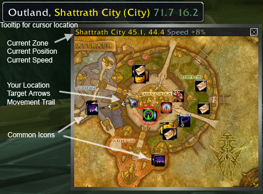

# Quêtes & Leveling

## Carbonite

CarboniteQuest est le principal concurrent de QuestHelper. Son avantage? Une interface encore plus claire et précise, un ordre de quêtes plus logique, ainsi que des fonctionnalités supplémentaires. Il s'adresse également aux joueurs PvP, il rends compte de la position des alliés, et intègre des macros prédéfinies telles que "Defendre ici" , "Attaquer là etc.



## DugisGuides



## ElvUI SmartQuestTracker



## EveryQuest



## Factionizer



## GainTracker



## LightHeaded



## ObjectiveAnnouncer



## Quest Helper


Conseillé et validé par l'équipe !


QuestHelper vous indiquera où et comment accomplir chaque quête au travers d'informations simples et lisibles.



## QuestPointer



## QuickQuest



## SmartQuest



## TomTom



## WhereToNow



## ZygorGuides



