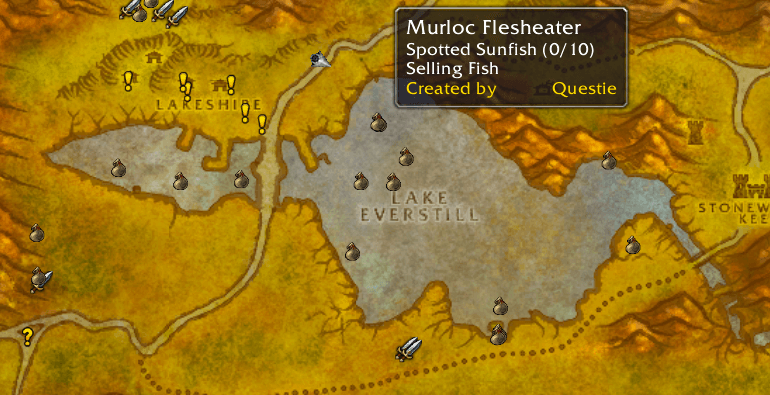

# Quêtes & Leveling

## Carbonite

CarboniteQuest est le principal concurrent de QuestHelper. Son avantage? Une interface encore plus claire et précise, un ordre de quêtes plus logique, ainsi que des fonctionnalités supplémentaires. Il s'adresse également aux joueurs PvP, il rends compte de la position des alliés, et intègre des macros prédéfinies telles que "Defendre ici" , "Attaquer là etc.


Carbonite


## DugisGuides


DugisGuides


## ElvUI SmartQuestTracker


ElvUI\_SmartQuestTracker


## EveryQuest


EveryQuest


## Factionizer


Factionizer


## GainTracker


GainTracker


## LightHeaded


LightHeaded


## MonkeyQuest

MonkeyQuest affiche les quêtes et leurs objectifs dans un joli cadre déplaçable de manière très personnalisable


Affichage quêtes et objectifs


## MonkeyBuddy

Le mode MonkeyBuddy vous permet de configurer facilement votre MonkeyQuest avec une belle fenêtre de configuration au lieu de commandes slash désagréables. Cliquez simplement sur le petit singe dans le coin inférieur droit de la mini-carte pour ouvrir la fenêtre.


Configuration facile MonkeyQuest


## ObjectiveAnnouncer


ObjectiveAnnouncer


## Quest Helper


Conseillé et validé par l'équipe !


QuestHelper vous indiquera où et comment accomplir chaque quête au travers d'informations simples et lisibles.


QuestHelper


## QuestPointer


QuestPointer


## QuickQuest


QuickQuest


## SmartQuest


SmartQuest


## TomTom


TomTom


## WhereToNow


WhereToNow


## ZygorGuides


ZygorGuides

