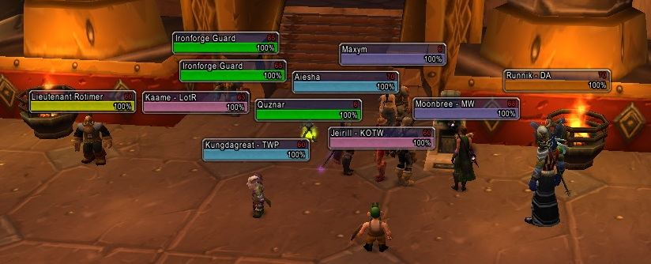
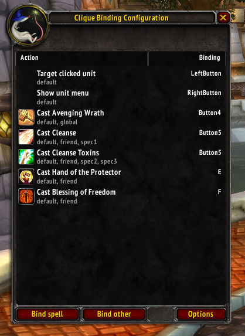
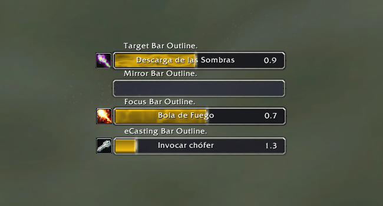
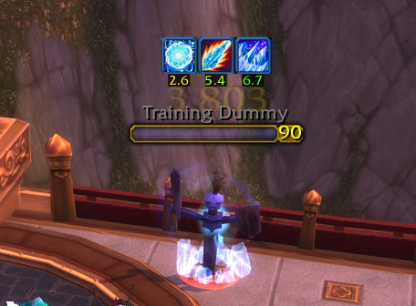
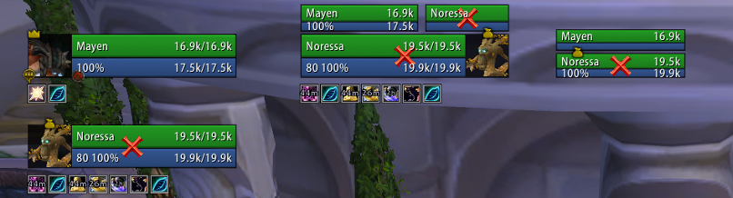
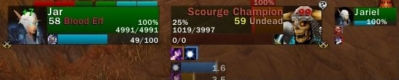
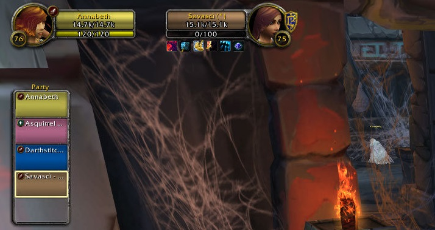

# Unit Frames

## Aloft

Personnalisation de certaines barres d'état :

* Icon de profil \(nom, niveau\) du joueur et de la cible
* Barre de vie, de mana, d'énergie, etc 
* Icons de raids 



## Clique

Permet de créer des raccourcis à la souris pour changer de cible rapidement.



## eCastingBar

Modifie la barre de cast, et permet d'aligner les barres de cast du joueur, de sa cible, de son focus et de certains sorts \(respiration aquatique, marche sur l'eau, etc\)



## KuiNameplates

Personnalisation de la barre d'état. 



## PitBull4

Cet addon vous permet de modifier l'affichage de votre personnage, de votre familier, de votre cible,... Il propose de nombreuses options comme l'affichage de la cible de votre familier, l'affichage de l'UF lors du passage sur un personnage avec votre souris \(mouse-over\) ainsi que la cible de ce personnage \(mouse-over target's\).



## PlateBuffs

Permet d'afficher directement les débuffs au dessus de la barre d'état du joueur, et d'en modifier les dimensions. 



## Quartz

Affiche la latence qui sépare le joueur et le serveur de jeu, cette latence est exprimé en rouge sur la barre de cast affiché par l'addon, ainsi le joueur peut anticiper celle-ci et lancé son sort plus rapidement, plus votre latence est grande, plus l'utilité de cette addon se fait sentir, vous pouvez gagner jusqu'à 0,3/0,4 secondes sur un cast de 3 secondes. De plus cette addon indique par une jauge vos prochaines attaques automatique CAC et attaques automatique à distance. Vous permet aussi de déplacer votre barre de cast.



## Shadowed Unit Frames

Modification et simplification des barres d'état 



## SimpleUnitFrames

Modification et simplification des barres d'état.



## Stuf Unit Frames

Modification et simplification des barres d'état.



## TidyPlates

Addon permettant d'afficher directement les débuffs au dessus de la barre de vie. 



## TidyPlates ThreatPlates

Module complémentaire à TidyPlates permettant de modifier les barres d'état, l'affichage des débuffs et les textes d'état



## UnitFramesImproved

Modification et simplification des barres d'état.



